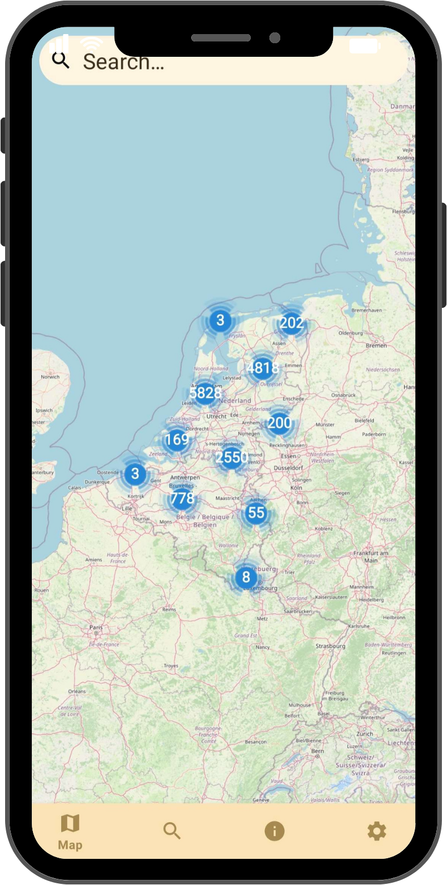
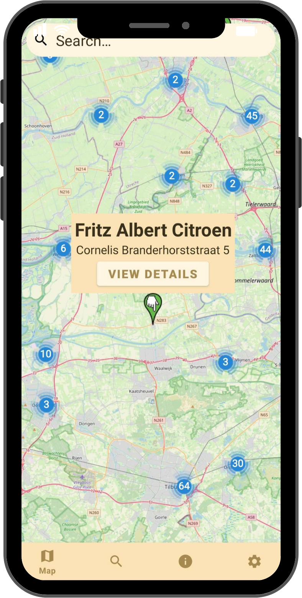
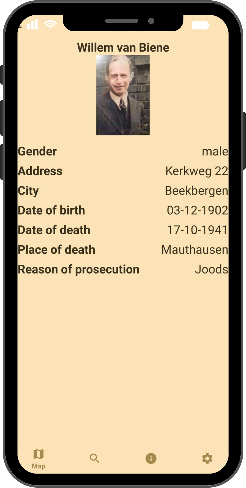
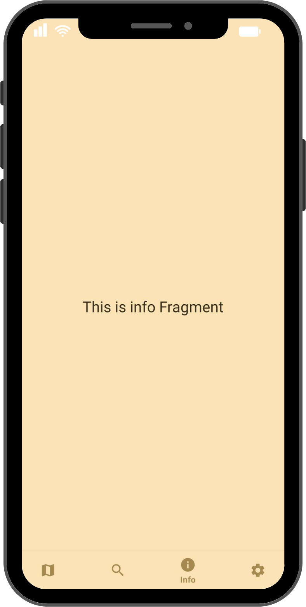
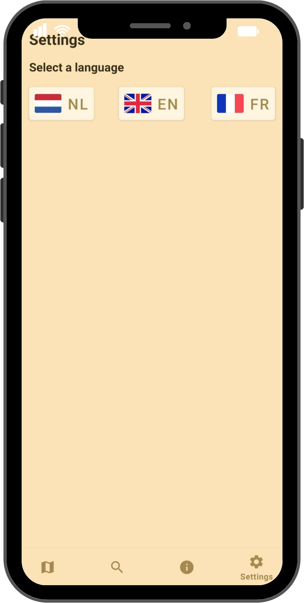

# Stolpersteine

## Table of Contents
- [Description](#description)
- [Features](#features)
- [Demo](#demo)
- [Designs](#designs)
- [Installation](#installation)

## Description

Stolpersteine is a group project that was requested by [Stichting 18 September](https://stichting18september.nl/). We were asked to update an outdated web application from Stichting 18 September. 

Stolpersteine are memorial stones that are placed by Stichting 18 September. Their functionality is the help remember the people who died during the Holocaust. The stones are covered in gold, each stone for one victim. The stones are placed at the place where the person has last lived freely. More information can be found [here](https://en.wikipedia.org/wiki/Stolperstein).

I was tasked by creating the Android version for the Stolpersteine app. Other members of the group were tasked with creating the PWA and iOS version. 

### Languages

    

## Features
- Show Stolpersteine on map
- Display a list of Stolpersteine
- Be able to search Stolpersteine and group them by People, Street and City
- Clicking on a marker navigates to a detailed information page
- Multi language (NL/EN/FR)
- Your able to switch between languages

## Demo

  <video loop muted autoplay src="../Portfolio/assets/projects/stolpersteine/stolpersteine.mp4" width="250"></video>

## Designs

  
  
  
  
  

## Installation
You can open the application in Android Studio and it should install everything needed automatically. 