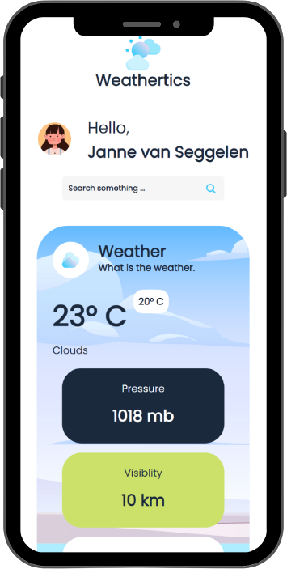
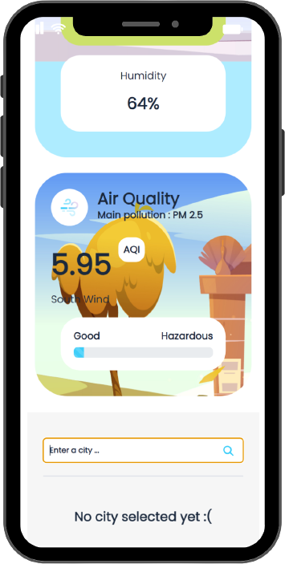
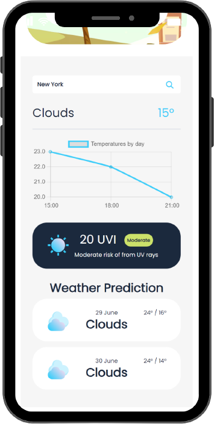

# Weatheristics

## Table of Contents
- [Description](#description)
- [Features](#features)
- [Demo](#demo)
- [Designs](#designs)
- [Installation](#installation)
- [Credits](#credits)

## Description
Weatheristics is an individual project I worked on for 4 weeks. I was asked to build a weather application. The application shows the weather and sends push-notification if it is about to rain.

### Languages

<p float="left">
    
    
    
</p>

## Demo
<p float="left">
    <video loop muted autoplay src="../Portfolio/assets/projects/weatheristics/weatheristics.mp4" width="250"></video>
</p>

## Designs
<p float="left">
    
    
     
</p>

## Features
- Be able to get weather information with your location
- Be able to get weather information from our cities
- Be able to send push notifications when it is about to rain or snow


## Installation
You can open the application in Visual Studio Code and run npm install in the root of the project to install all the needed packages.
```
npm install
```

## Credits 
Used libraries:
- [Open Weather API](https://openweathermap.org/api): I used this API to retrieve all the weather data.

