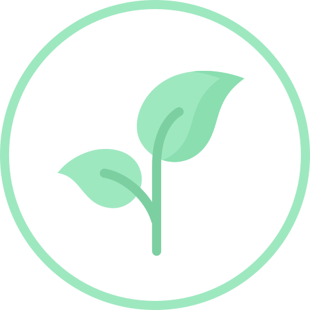

# VegiScan

## Table of Contents
- [Description](#description)
- [Features](#features)
- [Demo](#demo)
- [Installation](#installation)

## Description
VegiScan is a group project given by the school. We were tasked to build an application in iOS that helped people be more conscious about their consumption. The target audience is brought so we narrowed it down to people who are vegan or veganist. 

We started off by researching the target audience with a survey on what they were searching on products to see if they are vegan or not, what they were missing, if they already used an app from this and lastly, if they had any ideas. 
Based on this research we built this application. 

### Languages

    

## Features
- Be able to scan products
- Be able to view details from the product
- Be able to view your latest scans

## Demo

  <video loop muted autoplay src="../Portfolio/assets/projects/vegiscan/vegiscan.mp4" width="250"></video>

## Installation
You can open the application in XCode or a virtual machine and it should install everyting needed automaticly. 

## Credits 
Used libraries:
- [Code Scanner](https://github.com/twostraws/CodeScanner): We used this library to be able to scan the codes on products.
- [Open Food Facts](https://world.openfoodfacts.org/): We used this API to be able to recieve the information from every product. 
